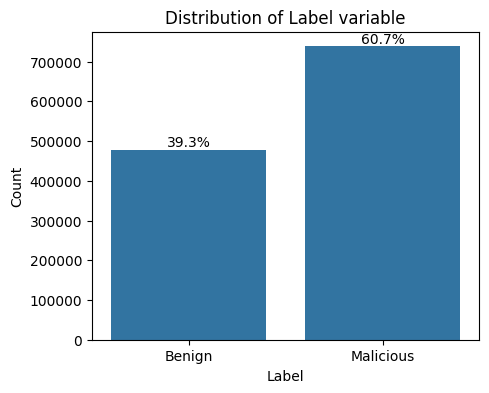
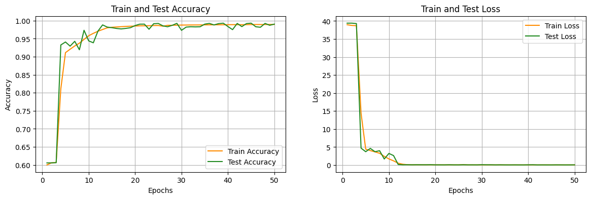

<h1 align="center">
<br>

<br>
<strong>Intrusion Detection using Machine Learning</strong>
</h1>


<h3 align="center">
<i>Implementation of machine learning models (pipelines) for detecting malicious intrusions.</i>
</h3>
<br>

[![License][license-badge]][license-link]

# 🚩 Table of Contents
* [About the Project](#about-the-project)
* [Installation](#installation)
* [Dataset and Feature Selection](#dataset-and-feature-selection)
* [Data Preprocessing](#data-preprocessing)
* [Random Forest Classifier](#random-forest-classifier)
* [Decision Tree Classifier](#decision-tree-classifier)
* [ANN](#ann)
* [CNN](#cnn)
* [CNN-LSTM](#cnn-lstm)
* [Endpoint using Docker Container](#endpoint-using-docker-container)
* [K8s Deployment](#k8s-deployment)
* [Contact](#Contact)
* [License](#License)


# About the Project
This project involves the implementation of various machine learning models for intrusion detection in a 5G network simulation. The task is to classify network traffic as ```benign``` or ```malicious``` based on the [NIDD][NIDD-link] dataset. 

The current project was carried out as a part of [CEID's][CEID-link] course "5G Architectures, Technologies, Applications and Key Performance Indicators (KPIs)" taught by Prof. Christos Verykoukis.

# Installation

To set up the project, follow these steps:

Begin by cloning the repository to your local machine:
```bash
git clone https://github.com/DmMeta/5G_Intrusion_detection.git
``` 
Navigate to project's root folder:
```bash
cd 5G_Intrusion_detection
```
(Optional) Establish a virtual environment for the project:
```bash
python3 -m venv venv
```
(Optional) Activate the virtual environment:
```bash
  # Linux/macOS:  
  source venv/bin/activate
 
  # Windows
  venv\Scripts\activate
```
Install the required dependencies:
```bash
pip3 install .
```

>[!TIP]
> The test - validation data of the binary classification problem addressed by this repository, along with the pretrained - fitted models, preprocessors, encoders, etc., can be extracted by executing scripts [fetch_data][script-data] and [fetch_models][script-models] located in the [script][script-folder] folder.

# Dataset and Feature Selection

## The significant role of the Feature Selection 
Before feeding data into machine learning (ML) models, **feature selection** plays a pivotal role. In today's era of massive and heterogeneous networks, where copious amounts of data are generated, the need for efficient processing and storage is paramount. As such, selecting and extracting the most pertinent features is a common practice in ML model training, leading to significant reductions in training times and improved learning efficiency.

Feature selection involves choosing a subset of features from the original dataset using various techniques like **filter**, **wrapper** and **embedded** methods. In our approach, we employed the filter method due to its statistical approach, which ensures generality across different ML models. This method operates independently of specific model characteristics or parameters, making it versatile and robust.

Before applying statistical-based filter methods for feature selection, we conducted preliminary steps. Initially, to maintain the generality of the intrusion detection system, we eliminated features like source - destination IP addresses and ports, as attacks could be uniquely identified with their presence. Subsequently, we removed obvious irrelevant features such as those with **null**, **zero** or **constant** values across all data points. 

For further feature reduction, we utilized the statistical-based filter method of **Pearson correlation**, which helped in identifying and removing redundant features effectively. By doing so, we streamlined the dataset, saving computational resources and enhancing the efficiency of subsequent ML model training. Finally, for the extraction of the top 10 most important features, we relied on the calculation of **ANOVA F-scores**, which guided our selection process based on statistical significance.

## Description of the Feature Selection process
In the initial dataset, there were **113** features (columns).

Regarding the target variable **Label**, its distribution is depicted in the following image:
<p align="center">
 
    <br>
    <em><i>Distribution of the Target Variable</i></em>
</p>
</br> 

After removing columns containing irrelevant features, the initial dataset's feature count was reduced from 113 to **106**. Following this, the feature selection process continued as follows:

- **NaN Columns Removal**: Columns with a high percentage of NaN values (threshold: 95%) were identified and eliminated. This step reduced the dataset's feature count to **70**.

- **Zero Columns Removal**: Subsequently, columns with a high percentage of zero values (threshold: 95%) were removed, further decreasing the dataset's feature count to **55**.

- **Constant Columns Removal**: Finally, columns with constant values were removed, resulting in a final feature count of **51**.

Following the refinement of the feature set, we tackled the issue of **redundant features**. If multiple features display a comparable relationship with the output label, they are deemed redundant, necessitating the retention of only one representative feature from this cohort. By eliminating redundant features, we enhanced the dataset's efficiency without compromising data quality. To achieve this, we utilized the **Pearson correlation coefficient**.

The Pearson correlation coefficient is a statistical measure used to determine the strength and direction of the linear relationship between two variables. In the context of intrusion detection, it's employed to identify correlations between different features in the dataset and assess their relevance to the classification task. Features with a high correlation to the target variable (malicious or benign) are likely to be more informative for the models and are thus selected.

The Pearson correlation coefficient ranges between -1 and +1. A value of +1 indicates a strong positive correlation, -1 denotes a strong negative correlation and 0 signifies no correlation. By computing the pairwise correlation coefficient for each feature pair and visualizing the results in a heatmap, we can illustrate the strength and direction of correlations between features. This visualization aids in identifying highly correlated feature pairs for potential removal from the dataset.

<p align="center">
 
    <br>
    <em><i>Pearson Correlation Matrix</i></em>
</p>

In our analysis, we considered the absolute values of the correlation coefficient, as a high negative correlation also indicates a strong relationship. Setting a threshold of 90%, we identified feature pairs with high correlation and removed one feature from each pair. Specifically, we retained the feature with the **highest correlation** to the target variable and discarded the **less correlated** feature (to the target variable) of the pair. This process ensured that only the most relevant features remained for model training.

Following the application of the aforementioned procedure, the number of features in the dataset decreased to **36**.

After removing all redundant features, we utilized the **ANOVA F-value** to identify the top **10**(remaining) features.

The ANOVA (Analysis of Variance) F-score is a statistical technique used to compare the means of two or more groups to determine if they are significantly different from each other. Features with high F-statistics and low p-values are considered more important for classification.

In the context of feature extraction for intrusion detection, ANOVA F-value were used to identify features that have significantly different means between the benign and malicious classes. Specifically, it calculates the variance between groups and within groups and then computes the ratio of these two values to derive the F-scores. By calculating the F-scores according to the formulas provided, we identified the **10** most informative features (the 10 features with the highest ANOVA F-values). 

## Two alternative feature selection methods

During the project implementation, it is important to highlight that ***two additional methods*** were utilized to extract the top 10 features from the dataset.

The first method involved employing a **random forest classifier**, a machine learning algorithm capable of assessing feature importance. By training a random forest classifier on the dataset, the importance of each feature was calculated based on its contribution to the model's predictive performance. Subsequently, the top 10 features were selected based on their respective importance scores.

In the second method, **Principal Component Analysis (PCA)** was utilized. PCA is a dimensionality reduction technique that aims to transform the original features into a new set of orthogonal variables called **principal components**. These principal components capture the maximum variance in the data. By performing PCA with a specified number of principal components (in this case 10), the dataset was transformed into a lower-dimensional space while retaining as much variance as possible. This can help improve the performance of machine learning models by reducing their computational needs. [The 10 principal components, representing the most significant patterns in the data, were then selected for further analysis]

# Data Preprocessing

## Importance of Data Preprocessing
Data preprocessing is a critical step in preparing datasets for machine learning models. It involves **cleaning**, **transforming** and **organizing** data to ensure its **quality** and **suitability** for analysis. By addressing issues such as missing values and scaling, data preprocessing improves the **accuracy** and **efficiency** of machine learning algorithms.

## Description of the Data Preprocessing process
To prepare our data for analysis, we implemented a series of preprocessing steps. 

Initially, we addressed missing values by filling in numerical features with their ***mean*** values and categorical features with their ***most frequent*** values. This ensured that our dataset was complete and ready for further analysis.

Next, we standardized numerical features using a process called **Standard Scaling**, also known as  **Z-score Normalization**. Standard scaling is a preprocessing technique used to standardize the range of features in the dataset. It involves transforming the features such that they have a mean of 0 and a standard deviation of 1. This ensures that all features have the same scale and can help improve the convergence speed and performance of the models, especially when dealing with features that have different units or scales.

Categorical features were transformed into a numerical format using encoding techniques. Specifically, we employed the **Ordinal Encoder**, which assigns a unique integer to each category within a feature. This conversion ensures that machine learning algorithms can interpret categorical data accurately during model training and evaluation.

Finally, we encapsulated the entire preprocessing process into a streamlined pipeline for easy replication and consistency across different analyses.

# Random Forest Classifier

## Characteristics and Structure 
Renowned for its **robustness** and **versatility**, Random Forest employs an ensemble of decision trees to deliver precise predictions across a myriad of scenarios. By dividing the dataset into numerous subsets and constructing decision trees for each, Random Forest effectively mitigates overfitting concerns while ensuring reliable performance, particularly in high-dimensional datasets.

This formidable algorithm excels in both classification and regression tasks, making it a staple choice across various domains. Its ability to handle complex datasets with ease, along with its resilience to class imbalances, solidifies its status as a go-to solution for predictive modeling like our binary classification problem.

We employed the [Random Forest Classifier][Random-Forest-link] provided by the [scikit-learn][scikit-learn-link] library, a widely-used Python library for machine learning tasks. Indeed, while we didn't fine-tune the parameters extensively in this particular implementation, the scikit-learn Random Forest classifier offers flexibility in parameter configuration. Parameters such as the number of trees in the forest and the maximum depth of each tree can be adjusted to optimize performance for our specific binary classification task if needed. This flexibility allows for further refinement of the model's predictive capabilities based on the characteristics of the dataset and the desired performance metrics.

## Results
Following the evaluation of the Random Forest Classifier, we achieved an accuracy of **99.96%**, indicating the proportion of correctly classified instances. The model's performance was further elucidated through the presentation of the **confusion matrix** and the **classification report**. 

The [confusion matrix][confusion-matrix-link] provides a detailed summary of the model's predictions compared to the actual class labels, offering insights into the model's ability to correctly classify instances across different classes. 

Additionally, the [classification report][classification-report-link] offers a comprehensive overview of the model's precision, recall, F1-score and support for each class, providing valuable information on its performance across various metrics. 

Together, these results provide a comprehensive assessment of the Random Forest model's performance in our binary classification task.

After conducting the experiment, the resulting confusion matrix was:

<p align="center">
 
    <br>
    <em><i>Confusion Matrix of Random Forest Classifier</i></em>
</p>

We observe that the resulting matrix is quite close to a diagonal matrix and based on the earlier mentioned factors, we conclude that the classifier obtained is quite efficient.

As a result of the very good confusion matrix we obtain the below classification report:

``Classification Report``

|              | Precision | Recall  | F1-Score | Support  |
|--------------|-----------|---------|----------|----------|
| Benign       | 0.999526  | 0.999477| 0.999501 | 143373   |
| Malicious    | 0.999661  | 0.999693| 0.999677 | 221394   |
| Accuracy     |           |         | 0.999608 | 364767   |
| Macro Avg    | 0.999593  | 0.999585| 0.999589 | 364767   |
| Weighted Avg | 0.999608  | 0.999608| 0.999608 | 364767   |


<br>

# Decision Tree Classifier

## Characteristics and Structure 
In addition to the Random Forest, we also implemented the [Decision Tree Classifier][Decision-Tree-link] from the [scikit-learn][scikit-learn-link] library. This classifier operates by recursively partitioning the dataset into subsets based on feature values, constructing a tree-like structure of decision nodes. Despite its simplicity, the Decision Tree Classifier provides valuable insights into the decision-making process, making it particularly useful when interpretability is essential. However, it may be prone to **overfitting**, especially in complex datasets. 

Both the Random Forest and Decision Tree classifiers are based on tree-based models. The Random Forest classifier consists of an ensemble of decision trees, each trained on a subset of the dataset in order to improve performance and reduce overfitting. In contrast, the Decision Tree classifier comprises a single tree structure, where each node represents a decision based on a specific feature.

We incorporated both classifiers (Decision Tree and Random Forest) to compare their performance and determine the most suitable model for our specific binary classification task.

## Results
Following the evaluation of the Decision Tree Classifier, we achieved an accuracy of **99.95%**. 

Here are the resulted [confusion matrix][confusion-matrix-link] and [classification report][classification-report-link]:

<p align="center">
 
    <br>
    <em><i>Confusion Matrix of Decision Tree Classifier</i></em>
</p>
<br>

``Classification Report``

|               | Precision | Recall   | F1-score | Support |
|---------------|-----------|----------|----------|---------|
|   Benign   |   0.999415 | 0.999422 | 0.999418  | 143495  |
|      Malicious   |   0.999625 | 0.999620 | 0.999623  | 221272  |
|    accuracy   |            |          |  0.999542 | 364767  |
|   macro avg   |   0.999520 | 0.999521 | 0.999520  | 364767  |
|weighted avg   |   0.999542 | 0.999542 | 0.999542  | 364767  |


Comparing these results with those of the Random Forest, both classifiers exhibited similar performance, indicating that the Decision Tree Classifier could be a viable alternative to the Random Forest. This indicates that the problem at hand may not be overly complex. However, it's noteworthy that due to its simple internal structure, the Decision Tree classifier executed significantly **faster** than the Random Forest.

> [!NOTE]
> Both classifiers (Decision Tree and Random Forest) were subjected to K-Fold Cross-Validation, confirming their robust, accurate and strong performance.

# ANN
Entering the realm of neural networks, we head to **Artificial Neural Networks (ANNs)**, a cutting-edge approach for tackling complex classification tasks. We implemented a simple ANN model consisting of a small number of hidden layers.

## Architecture of our ANN model
Our ANN model is designed with **simplicity** and **effectiveness** in mind.

The architecture of our ANN comprises:

**Input Layer**: This layer serves as the initial gateway for receiving raw data, consisting of a fixed number of features (10 from above feature selection process). Each feature encapsulates a unique attribute-characteristic of the input samples.

**Hidden Layer**: Situated at the core of the model, the hidden layer is densely populated with interconnected neurons. Each neuron is intricately linked to every neuron in the preceding layer(fully connected(FC) layer). The number of neurons in this layer, known as the hidden_size, is meticulously specified to balance model complexity and performance.

**Activation Function (ReLU)**: After the first linear transformation (which is the fully connected layer from the input to the hidden layer), we apply the Rectified Linear Unit (ReLU) activation function (to the output of the first linear layer before passing it to the next layer). Renowned for its capability to introduce non-linearity, ReLU plays a crucial role in enabling the model to discern intricate patterns and relationships within the data. Additionally, ReLU helps alleviate the issue of the vanishing gradient, which can impede the training process in deeper neural networks by allowing gradients to propagate more effectively during backpropagation.

**Output Layer**: The model's final computations take place in the output layer, where it generates the ultimate predictions. In our binary classification task, where we discern between benign and malicious samples, the output layer comprises a single neuron. We apply the Sigmoid activation function deliberately to transform the output into a meaningful probability score, constraining it within the range of 0 and 1. 

The structure of the ANN model is depicted in the image below:
<p align="center">
 
    <br>
    <em><i>Architecture of the ANN model</i></em>
</p>
<br>

Implementation code of the ANN model:
```python
class ANN_BinaryClassifier(nn.Module):
    '''
    A class representing a binary classification artificial neural network (ANN).

    Args:
        input_size (int): The number of input features.
        hidden_size (int): The number of neurons in the hidden layer.
        output_size (int): The number of output neurons (typically 1 for binary classification).

    Attributes:
        model (nn.Sequential): The sequential neural network model architecture.

    Methods:
        forward(x): Defines the forward pass of the neural network.

    '''

    def __init__(self, input_size, hidden_size, output_size = 1):
        '''
        Initializes the ANN_BinaryClassifier class.

        Args:
            input_size (int): The number of input features.
            hidden_size (int): The number of neurons in the hidden layer.
            output_size (int): The number of output neurons (typically 1 for binary classification).
        '''

        super(ANN_BinaryClassifier, self).__init__()

        # Define the architecture of the neural network
        self.model = nn.Sequential(
            nn.Linear(input_size, hidden_size),  # Fully connected layer from input to hidden layer
            nn.ReLU(),  # ReLU activation function
            nn.Linear(hidden_size, output_size),  # Fully connected layer from hidden to output layer
            nn.Sigmoid()  # Sigmoid activation function for binary classification
        )

    def forward(self, x):
        '''
        Defines the forward pass of the neural network.

        Args:
            x (torch.Tensor): The input tensor.

        Returns:
            torch.Tensor: The output tensor after passing through the neural network.
        '''

        # Define the forward pass of the neural network
        return self.model(x)
```

## Model Parameters

**Input Size**: The input size corresponds to the number of features in the input data. It was determined based on the dimensionality of the input features provided to the model(**10** from the previous feature selection process).

**Hidden Size**: The hidden size represents the number of neurons in the hidden layer of the neural network. In our case, we used a hidden size of **8**.

**Output Size**: For binary classification, the output size is typically set to **1**, representing the predicted probability of belonging to the positive class.

## Model Training Configuration

**Optimizer**: We employed the [Adam][Adam-link] optimizer, which is a popular choice for training neural networks due to its adaptive learning rate and momentum. It efficiently adjusts the learning rates for each parameter during training, leading to faster convergence and improved performance.

**Loss Function**: For this binary classification problem, we utilized the [Binary Cross-Entropy Loss][BCELoss-link] function (BCELoss). This loss function is well-suited for binary classification problems, measuring the dissimilarity between the model's predictions and the actual labels.

**Learning Rate**: The learning rate was set to **0.001**, which is a commonly used initial learning rate for Adam optimization. This value controls the step size during parameter updates and influences the speed and stability of the training process. Additionally, we could consider implementing learning rate schedulers, such as the Nestorov (Momentum) scheduler, to dynamically adjust the learning rate during training based on certain criteria, providing further fine-tuning capabilities and potentially enhancing model performance.

**Batch Size**: We used a batch size of **32** for training the model. Batch size determines the number of samples processed before updating the model's parameters. A smaller batch size can lead to more frequent updates and potentially faster convergence, while a larger batch size can provide more stable updates.

**Number of Epochs**: The model was trained for **50** epochs. An epoch refers to one complete pass through the entire training dataset. Training for multiple epochs allows the model to learn from the data multiple times, improving its performance over time.

## Results

After training the ANN model, we evaluate its performance using various metrics. The accuracy achieved on the test set is approximately **98.7%**, indicating the model's ability to correctly classify samples into their respective classes. Additionally, the loss, a measure of the discrepancy between predicted and actual values, is remarkably low, underscoring the model's effectiveness in capturing the underlying patterns in the data.

The [confusion matrix][confusion-matrix-link] and [classification report][classification-report-link] obtained from the evaluation of the ANN model are as follows:

<p align="center">
 
    <br>
    <em><i>Confusion Matrix of ANN Classifier</i></em>
</p>
<br>

``Classification Report``
|            | Precision |  Recall  | F1-Score | Support |
|------------|-----------|----------|----------|---------|
|   Benign   |   0.976831   |   0.990740  |   0.983736  |  87230  |
| Malicious  |   0.994095   |   0.985148  |   0.989601  | 155948  |
|   Accuracy |           |          |   0.987314  | 243178  |
|  Macro Avg |   0.985463   |   0.987944  |   0.986669  | 243178  |
| Weighted Avg|  0.987409   |   0.987314  |   0.987330  | 243178  |

<br>
<p align="center">
 
    <br>
    <em><i>Evolution of Accuracy and Loss for ANN Model During Epochs</i></em>
</p>
<br>


Examining the confusion matrix reveals a high level of correct classifications, with the majority of samples accurately categorized as either benign or malicious. This is further corroborated by the classification report, which showcases good precision, recall and F1-score for both classes. 


## Stratified K-Fold Cross Validation

We employed [Stratified K-fold Cross-Validation][StrK-Fold-CV-link] (in our case K = 5) to assess our model's performance. This technique involves dividing the dataset into K folds while ensuring that each fold maintains the same class distribution as the original dataset. By iteratively training and evaluating the model on different fold combinations, we obtain a more robust estimation of its performance across various data subsets. This approach helps mitigate the risk of overfitting and provides a more reliable evaluation of the model's predictive capabilities.

<br>
<p align="center">
 
    <br>
    <em><i>Evolution of Accuracy and Loss for ANN Model During Epochs at Stratified 5-Fold Cross Validation</i></em>
</p>
<br>

Based on the results of the stratified 5-fold cross-validation, we can confidently conclude that the model exhibits robust performance. The consistently high accuracy and low loss scores across all folds signify the reliability and generalizability of the model across diverse data distributions.

# CNN

Subsequently, delving into the field of deep learning, we implemented a CNN model. CNN stands for Convolutional Neural Network, which is a type of artificial neural network designed to recognize patterns in given structures, such as images or sounds. Although CNN models are primarily used in applications with images and pattern recognition, we attempted to develop a CNN model that would address the (simple) binary classification problem we have on the input tabular dataset.

## Architecture of our CNN model

Our CNN model architecture comprises several essential components:

**Convolutional Layer**: The initial layer of the CNN, where convolutional filters traverse the input data to extract local features. Despite typically being used for image data, in our model, we apply a 1-dimensional convolutional layer suitable for tabular data. This layer scans across the sequential features, capturing patterns and relationships within the data to facilitate effective learning and decision-making.

**Activation Function (Tanh)**: Following the convolutional operation, the hyperbolic tangent (Tanh) activation function introduces non-linearity to the model, enabling it to learn complex patterns from the input data.

**Flatten (Layer)**: After the activation function, the output is flattened into a one-dimensional tensor, preparing it for input to the following fully connected layer.

**Fully Connected Layer**: A dense layer where each neuron is connected to every neuron in the preceding layer. This layer learns global patterns from the spatial features extracted by the convolutional layers.

**Output Layer**: The final layer of the CNN, which produces the model's predictions. Given our binary classification problem, the output layer comprises a single neuron with a sigmoid activation function, producing probabilities indicating the likelihood of belonging to the positive class.

The structure of the CNN model is depicted in the image below:
<p align="center">
 
    <br>
    <em><i>Architecture of the CNN model</i></em>
</p>
<br>

Implementation code of the CNN model:
```python
class CNN_BinaryClassifier(nn.Module):
    def __init__(self, input_channels=1, kernels=16, kernel_size=3, input_features=10, classes=1):
        """
        Convolutional Neural Network (CNN) for binary classification.

        Args:
            input_channels (int): Number of input channels.
            kernels (int): Number of kernels/filters in the convolutional layer.
            kernel_size (int): Size of the convolutional kernel.
            input_features (int): Number of input features.
            classes (int): Number of output classes (default is 1 for binary classification).
        """
        super(CNN_BinaryClassifier, self).__init__()
        # Define the CNN architecture
        self.model = nn.Sequential(
            nn.Conv1d(in_channels=input_channels, out_channels=kernels, kernel_size=kernel_size),  # Convolutional layer
            nn.Tanh(),  # Activation function
            nn.Flatten(),  # Flatten layer
            nn.Linear(kernels * (input_features - kernel_size + 1), classes),  # Fully connected layer
            nn.Sigmoid()  # Output layer with sigmoid activation
        )

    def forward(self, x):
        """
        Forward pass of the CNN model.

        Args:
            x (torch.Tensor): Input data tensor.

        Returns:
            torch.Tensor: Output tensor after passing through the model.
        """
        return self.model(x)  # Return the output of the model
```

## Model Parameters

**Input Channels**: Typically set to **1** for tabular data, representing the number of input channels.

**Kernels**: The count of kernels or filters in the convolutional layer, dictating the depth of feature maps learned by the network. We have **16** kernels in our convolutional layer.

**Kernel Size**: Specifies the size of convolutional kernels, determining the receptive field over input data. Each kernel has a size of **3**.

**Input Features**: The input features corresponds to the number of features in the input data. It was determined based on the dimensionality of the input features provided to the model(**10** from the previous feature selection process).

**Classes**: Set to **1** for binary classification, indicating the number of output classes.

## Model Training Configuration

**Optimizer**: We employed the [Adam][Adam-link] optimizer.

**Loss Function**: We utilized the [Binary Cross-Entropy Loss][BCELoss-link] function (BCELoss).

**Learning Rate**: Governs optimization step size, impacting training convergence and stability. Our choice of **0.001** aligns with common practices for Adam optimization.

**Batch Size**: We opted for a batch size of **64** for computational efficiency.

**Number of Epochs**: The model was trained for **30** epochs. An epoch refers to one complete pass through the entire training dataset. Training for multiple epochs allows the model to learn from the data multiple times, improving its performance over time.

## Results

After evaluating the CNN model, we achieved impressive metrics. The accuracy of our model was **99.9%**, while the loss was remarkably low, registering only **0.0041**. These results demonstrate the effectiveness and generalization capability of our model across different datasets.

Following the evaluation, the resulting [confusion matrix][confusion-matrix-link] and [classification report][classification-report-link] are as follows:

<p align="center">
 
    <br>
    <em><i>Confusion Matrix of CNN Classifier</i></em>
</p>
<br>

``Classification Report``

|            | Precision |  Recall  | F1-Score | Support |
|------------|-----------|----------|----------|---------|
|   Benign   |   0.999133   |   0.998955  |   0.999044  |  95733  |
| Malicious  |   0.999322   |   0.999437  |   0.999379  | 147445  |
|   Accuracy |           |          |   0.999247  | 243178  |
|  Macro Avg |   0.999227   |   0.999196  |   0.999212  | 243178  |
| Weighted Avg|  0.999247   |   0.999247  |   0.999247  | 243178  |

<br>
<p align="center">
 
    <br>
    <em><i>Evolution of Accuracy and Loss for CNN Model During Epochs</i></em>
</p>
<br>

After evaluating the CNN model, we can confidently assert its effectiveness in tackling the binary classification task. With precision, recall and F1-score metrics exceeding 99%, along with an impressive accuracy of nearly 99.93%, the model demonstrates remarkable performance in distinguishing between the two classes. These results underscore the CNN's capability to learn intricate patterns and features from tabular data, showcasing its potential for various classification tasks beyond image analysis.
 
 Βeing a more complex architecture tailored for image data, the CNN model demonstrates superior performance compared to the ANN model. This superiority can be attributed to the CNN's ability to capture intricate spatial hierarchies and local patterns within the tabular data, which might have been overlooked by the simpler ANN architecture.

## Stratified K-Fold Cross Validation

We employed [Stratified K-fold Cross-Validation][StrK-Fold-CV-link] with K = 5 to evaluate our model's performance.

<br>
<p align="center">
 
    <br>
    <em><i>Evolution of Accuracy and Loss for CNN Model During Epochs at Stratified 5-Fold Cross Validation</i></em>
</p>
<br>

The graph illustrates the accuracy and loss trends of the convolutional neural network (CNN) model during epochs in the Stratified 5-Fold Cross-Validation. Consistently high accuracy and low loss scores across all folds indicate the model's stability and ability to generalize well across diverse data distributions.


# CNN-LSTM 


## Models Used

- Artificial Neural Networks (ANN)
- Convolutional Neural Networks (CNN)
- CNN with Long Short-Term Memory (LSTM) layer
- Decision Tree
- Random Forest


 such that they have a mean of 0 and a standard deviation of 1. 
## Deployment to Kubernetes (k8s) Cluster

The intrusion detection service has been deployed to a Kubernetes cluster to ensure scalability, availability, and ease of management, using two replicas of a fastapi server with one endpoint for prediction of the network flow.


## Installation

```bash
# Clone the repo
git clone https://github.com/DmMeta/5G_Intrusion_detection.git

# Navigate into the directory
cd 5G_Intrusion_detection

# Install dependencies
pip3 install .


```
# Contact

### Authors:

- Metaxakis Dimitris | <a href="mailto:d.metaxakis@ac.upatras.gr">d.metaxakis@ac.upatras.gr</a>
- Sofotasios Argiris | <a href="mailto:up1079616@ac.upatras.gr">up1079616@ac.upatras.gr</a>


# License

Distributed under the [MIT] License. See `LICENSE.md` for more details.

<!-- MARKDOWN LINKS & IMAGES -->
[NIDD-link]: https://etsin.fairdata.fi/dataset/9d13ef28-2ca7-44b0-9950-225359afac65/data
[MIT]: https://en.wikipedia.org/wiki/MIT_License
[CEID-link]: https://www.ceid.upatras.gr/
[license-badge]: https://img.shields.io/badge/License-MIT-blue.svg
[license-link]: https://github.com/DmMeta/ChordSeek/blob/main/LICENSE
[Random-Forest-link]: https://scikit-learn.org/stable/modules/generated/sklearn.ensemble.RandomForestClassifier.html
[scikit-learn-link]: https://scikit-learn.org/stable/
[confusion-matrix-link]: https://scikit-learn.org/stable/modules/generated/sklearn.metrics.confusion_matrix.html
[classification-report-link]: https://scikit-learn.org/stable/modules/generated/sklearn.metrics.classification_report.html
[Decision-Tree-link]: https://scikit-learn.org/stable/modules/generated/sklearn.tree.DecisionTreeClassifier.html
[Adam-link]: https://pytorch.org/docs/stable/generated/torch.optim.Adam.html
[BCELoss-link]: https://pytorch.org/docs/stable/generated/torch.nn.BCELoss.html
[StrK-Fold-CV-link]: https://scikit-learn.org/stable/modules/generated/sklearn.model_selection.StratifiedKFold.html
[script-data]: /scripts/fetch_data.sh
[script-models]: /scripts/fetch_models.sh
[script-folder]: /scripts/